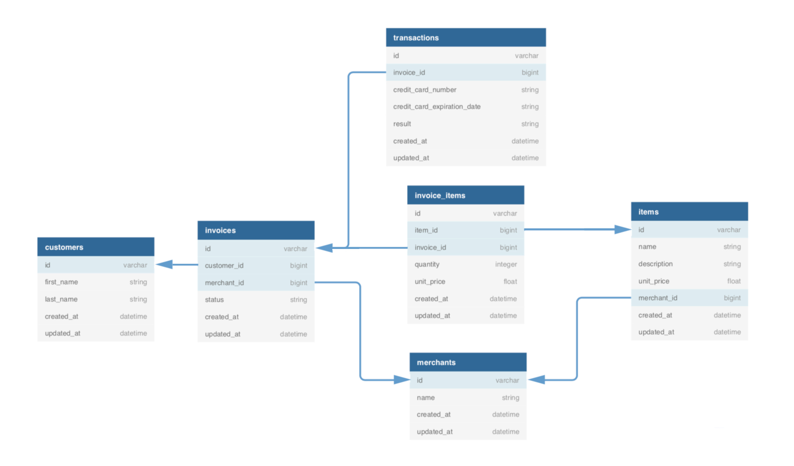

# Rails Engine API

## Description
**Rails Engine API** is the back end of a project to demonstrate service-oriented architecture for a fictional E-Commerce Application, where the front and back ends are separate and communicate via APIs.

Goals of the project include:
- Exposing an API
- Using serializers to format JSON responses
- Testing API exposure
- Compose advanced ActiveRecord queries to analyze information stored in SQL databases

## Database Setup

Once you have `forked` and `cloned` your copy of this repo, run the following terminal commands to create your database:
- `rake db:{drop,create,migrate,seed}`
- `rails db:schema:dump`

Check that your `schema.rb` exists and use a tool like `Postico` to confirm the data matches the tables shown above.

## Endpoints  

**MERCHANTS**
#### All Merchants
```
GET /api/v1/merchants
```
#### All Merchants (OPTIONAL pagination params)
```
GET /api/v1/merchants?per_page=<int>&page=<int>
```
#### Single Merchant
```
GET /api/v1/merchants/<id>
```
**ITEMS**
#### All Items
```
GET /api/v1/items
```
#### All Items (OPTIONAL pagination params)
```
GET /api/v1/items?per_page=<int>&page=<int>
```
#### Single Item
```
GET /api/v1/items/<id>
```
#### Create Item
```
POST /api/v1/items
```
#### Update Item
```
PATCH /api/v1/items/<id>
```
#### Destroy Item
```
DELETE /api/v1/items/<id>
```
**RELATIONSHIPS**
#### Merchant's Items
```
GET /api/v1/merchants/<id>/items
```
#### Item's Merchant
```
GET /api/v1/items/<id>/merchant
```
**SEARCH FOR SINGLE RECORD**
#### Merchant or Item by Name
```
GET /api/v1/merchants/find?name=<text fragment>
GET /api/v1/items/find?name=<text fragment>
```
#### Item by Minimum Price
```
GET /api/v1/items/find?min_price=<numerical value>
```
#### Item by Maximum Price
```
GET /api/v1/items/find?max_price=<numerical value>
```
#### Item by Minimum and Maximum Price
```
GET /api/v1/items/find?max_price=<numerical value>&min_price=<numerical value>
```
**SEARCH FOR ALL RECORDS**  
Follows the same rules as finding "ONE" endpoints, just substitute `find_all` for `find` in the query parameter. For example:
#### Merchants by Name
```
GET /api/v1/merchants/find_all?name=<text fragment>
```
**BUSINESS LOGIC ENDPOINTS**
#### Merchants with Most Revenue
```
GET /api/v1/revenue/merchants?quantity=<integer>
```
#### Total Revenue for a Given Merchant
```
GET /api/v1/revenue/merchants/<id>
```
#### Potential Revenue of Unshipped Orders
```
GET /api/v1/revenue/unshipped?quantity=<integer>
```
NOTE: `quantity` is an optial param referring to the requested number of records to return

## Starting Rails Server
To run server on `localhost:3000/`:
  ```
  rails s
  ```

## Technologies and Frameworks
- Back-End
  - Language: Ruby 2.6.3
  - Framework: Rails 5.2.6
  - Testing: RSpec, SimpleCov
  - Database: PostgreSQL
